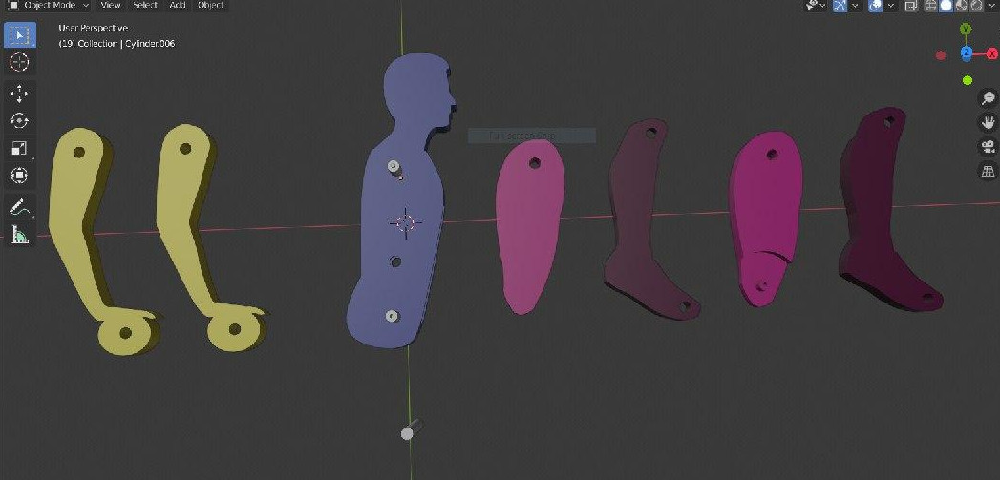
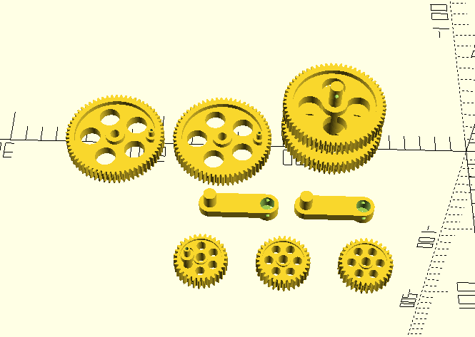
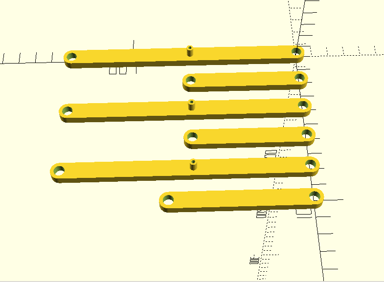
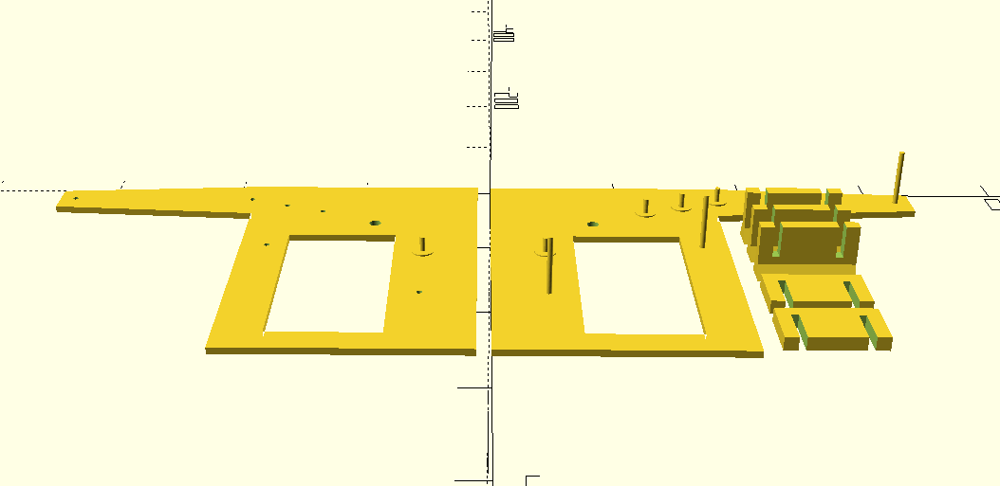

**The Pushing Man** is a mechanical character, a souvenir. It is a man who is pushing something heavy and 
it makes realistic movements. The engine of the mechanism is gears that can be rotated by hand. 
As gears are rotated the pushing man moves. To imagine that see below gif file.
 
### Partitions

#### The man
The man consists of a body-head, right hand and leg,left hand and leg. Legs also consists of two partitions 
that allow the character to make movements. They are shown on the screenshot below.	

#### Gears
Gears are the engine of the construction. Their dimensions and positions are well calculated and 
makes all the movements of the character. There are four types of gears, a couple of gears to move legs, 
a gear for rotating and its rotator, a gear to move the body, and two to connect other gears to each other. 

#### Bands
Bands are special connectors that connect legs and the body with gears. There are three bands, 
one to connect the body gear to the body of the pushing man, other to connect the gear for legs to the right and 
left legs respectively.

#### The hull
The hull is used as a bounds of the construction. All partitions are collected, and connected in the hull. 
It is a special box with connectors and origins for gears. It is separated into two parts, the left and right parts. 
Partitions are collected using screws and special pipes.

### References
- Github repository of a mechanical character animator java program:  https://github.com/DOSLAN/Mechanical-Characters-animator
- Other media file from the project creation process: https://drive.google.com/open?id=1imLWmjRsIfrUiP4G0gRbWdwJOhqf6U5a

Copyright (c) 2020 Nurbol Chorobaev, Doslan Zheksheev, Muhammed Alanov, Bekzhol Zholdubai uulu